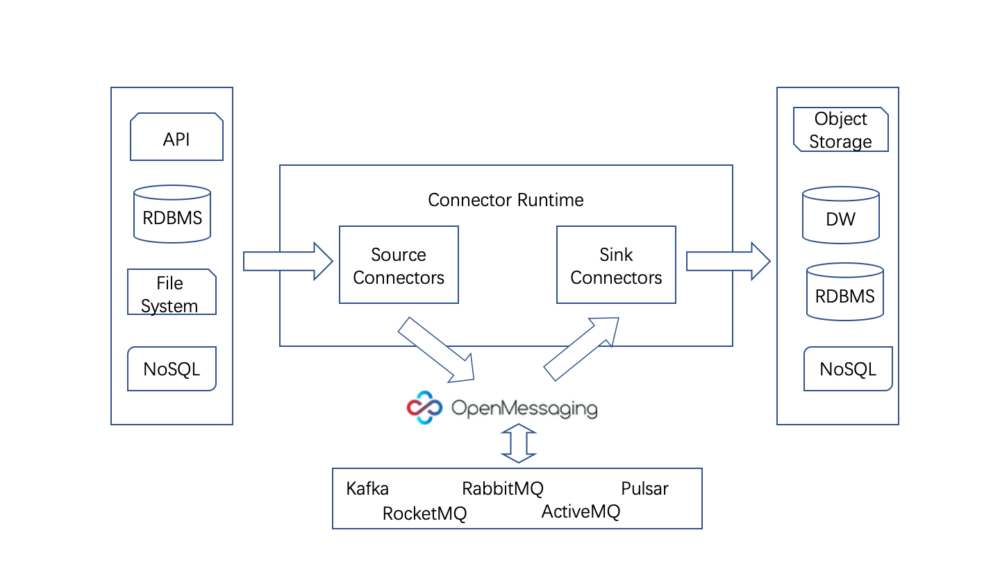

# Message Connector 简介

### 消息路由（Message Connector）是什么？



**Connector的定义**

连接器实例属于逻辑概念，其负责维护特定数据系统的相关配置，比如链接地址、需要同步哪些数据等信息；在connector实例被启动后，connector可以根据配置信息，对解析任务进行拆分，分配出task。



**消息路由**主要用于不同地域之间消息的同步，保证地域之间的数据一致性和复制备份。RocketMQ的消息路由特性打通了多个集群之间的消息互通，高效地实现了分布在不同地域之间的RocketMQ集群的消息同步复制

### 消息路由（Message Connector）的几个概念：

 简单理解**Message Connector**就是借RocketMQ、kafka等从某个系统获取数据，借助消费消息写入到其他系统。**主要由Source Connector，Sink Connector、Runtime组成。**

 **Source Connector**负责从其它系统获取数据。

 **Sink Connector**负责从Producer中消费消息，将数据写入到另外的系统。

 **Runtime**是Source ，Sink connector的运行时环境，负责加载Connector，提供RESTful接口，启动Connector任务，集群节点之间服务发现，配置同步，消费进度保存，故障转移，负载均衡等能力。

**OpenMessaging** 是一套消息中间件领域的规范。**OpenMessaging Connect是Connect方面的api**，OpenMessaging 还有其他各种消息中间件邻域的规范，例如mq客户端规范，存储规范，实现OpenMessaging 规范可以做到厂商无关。**具体的Connector可以基于这套规范实现**。  

#### RocketMQ Connector的几个概念：

简单理解RocketMQ Connect就是借RocketMQ从其他系统获取数据发送到RocketMQ，然后从RocketMQ消费消息写入到其他系统。主要由**Source Connector，Sink Connector，Runtime**组成。

**Source Connector**负责从其它系统获取数据，通过Producer发送到到RocketMQ。

**Sink Connector负**责从Producer中消费消息，将数据写入到另外的系统

**Runtime**是Source ，Sink connector的运行时环境，负责加载Connector，提供RESTful接口，启动Connector任务，集群节点之间服务发现，配置同步，消费进度保存，故障转移，负载均衡等能力。

### 消息路由\(Message connector\)特性解决的问题

在之前版本（RocketMQ 4.X版本）中，不同集群的Broker之间是无法进行数据备份和消息互通，这样会有以下几个缺点：

* **消息可靠性和可用性**

不管是采用 **Master/Slaver** 模式，还是采用**Dledger**的多副本模式，均保证了在**同一个集群（Cluster）中的可靠性和可用性**。但是考虑以下情景:

> 如果用户部署在单个Region中的RocketMQ集群出现机房毁坏、磁盘故障、服务器损毁等非可预见性重大问题时，就会导致单个集群的可靠性失效。如果，部署在单个Region内的集群能够通过异步方式将消息传递至其他Region的集群，那么即可做到**跨Region的消息同步复制，提高其可靠性和可用性。**

* **用户备份与复制**

原有的RocketMQ 4.X版本**不具备集群之间“备份与复制”的特性**，因此想要数据无法真正做到在其他集群或者其他Region中存在全量的备份内容。无法满足使用RocketMQ的用户实现两地三中心的多活架构部署。

* **部署多 Region 消息的消费**

目前，RocketMQ无法满足跨Region的消息的消费。

> 比如，用户系统A作为Producer部署于Region A，用户系统B作为Consumer部署于Region B，系统A发送一条消息需要系统B来消费。

### 更多架构设计



### Connector详解


### **快速上手**



