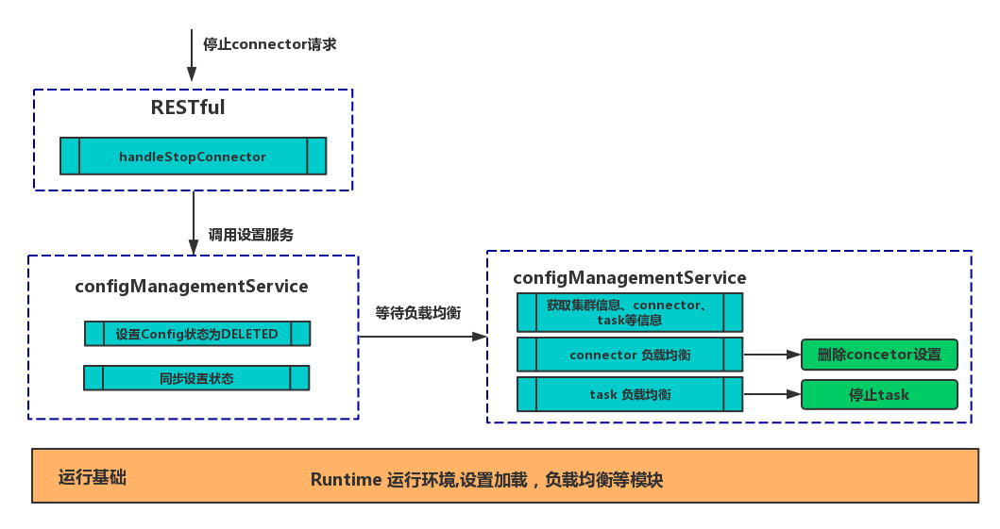

# Connector生命周期

## Connector生命周期

### 生命周期总览

一个connector的生命周期主要分为三个阶段：**启动、运行、停止**

* **启动**

        ****设置connector实例配置，同步配置，然后触发负载均衡启动connector和task。

* **运行**

        ****运行task的具体任务，依据topic和不同的connector运行具体任务。

* **停止**

       停止task任务，删除connector的配置信息。

### 创建并启动connector

创建并启动connector过程大致可以分为以下几个阶段：

* **RESTful阶段**

1. 发送创建connector请求
2. 处理请求，调用configManagementService进行参数配置

* **configService阶段**

1. 添加配置信息
2. 加载connector实现的类文件
3. 同步connector配置和task配置
4. 触发connector配置更新，从而触发负载均衡

* **负载均衡阶段**

1. 获取集群信息，消费进度、connector、task等信息
2. 先对connector进行创建
3. 重新计算task并启动对应的task任务

### 运行Task任务


**每种connector的具体任务过程不一样，具体参照对应的connector的Source Task与Sink Task**


### 停止并删除connector

停止并删除connector过程大致可以分为以下几个阶段：

* **RESTful阶段**

1. 发送停止connector请求
2. 处理请求，调用configManagementService进行参数配置

* **configService阶段**

1. 设置对应的connector的config状态为**DELETED**
2. 同步设置
3. 等待负载均衡

* **负载均衡阶段**

1. 获取集群信息，消费进度、connector、task等信息
2. 获取要删除的所有connector实例，并删除
3. 重新计算task并停止不在列表的task


### 注意事项

1. 负载均衡阶段对**创建和删除两种操作是同时进行的，**上面分开是为了表达方便。
2. 创建新的connector会立即触发负载均衡，而删除操作只能等待定时负载均衡。
3. **集群信息变化也会引起负载均衡，同样也会进行connector的创建和删除。**


