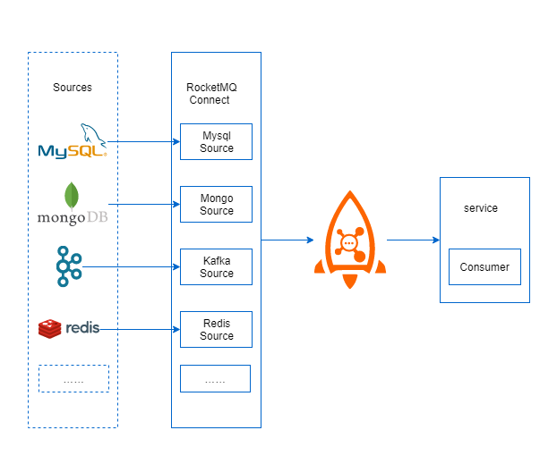

# RocketMQ Connect 应用场景

## 应用场景

### 场景一 MySQL同步数据到MySQL

例如需要同步生产环境的MySql数据到分析系统的MySql，只需要上游提供MySql Source  Connector从MySql读取数据发送到RocketMQ，下游Sink端提供MySql Sink Connector从RocketMQ拉去数据写入到分析系统的MySql，同时可以解决上述一些挑战。

1、Source和Sink Connector可以做到复用,可以解决多数据源之间数据打通问题。

2、提供两种方式提高并行度，

* 一是增加worker进程数量，如处理MySql binlog。
* 二是增加Task数量，如处理mongodb分片，一个Task处理一个分片，多个分片启动多个Task。

3、RocketMQ Connect支持集群，一个节点挂了，会将任务负载均衡方式分配到其他节点，并且会同步处理位置，根据处理位置继续处理。

4、RocketMQ Connect可增加或减少集群节点，节点变化后会通过负载均衡方式重新分片任务，有良好的伸缩性。

### **场景二 相同数据源数据同步**

由于数据重要性比较高，比如电信，银行行业。数据安全性比较高，需要建设另外两个中心，每个中心有个RocketMQ集群，防止一个中心挂掉，数据大量丢失。RocketMQ无论是主从模式，还是多副本的方式，都自能保证一个集群的数据存在多分，如果一个中心挂了数据是没法保证的。如果要建设两个中心，就牵涉到两个中线RocketMQ集群之间数据同步，借助RocketMQ connect就可以实现两个中心之间RocketMQ集群的数据同步。这也是现在社区中RocketMQ Replicator项目要做的事情。  

### **场景三 异构数据源数据同步场景**

现在生产中使用的是Kafka作为消息中间件，后面想换成RocketMQ。只需要Kafka Source Connector和RocketMQ Sink Connector就可以完成mq之间的数据同步，从而完成mq的切换。


同构数据源和异构数据源同步数据是Source和Sink Connector都存在的情况下。


### 场景四 源数据直接消费

RocketMQ Connect能否配合当前业务系统中的RocketMQ只使用Source Connector从数据源获取数据发送到RocketMQ，业务直接使用consumer订阅topic，处理消息呢？这种也是支持的，只需要配置RocketMQ Converter，Converter是启动Connector时传入的参数，会对消息做一些转换处理。如果选用RocketMQ Converter就不会对数据做转换，并且会把一部分数据放到message的property中，方便业务系统直接消费处理。

### 场景五 源数据直接同步示意图

与场景四相似，producer之间发送数据到RocketMQ，RocketMQ Connect配合当前业务系统中的RocketMQ只使用Sink Connector同步数据。  

\*\*\*\*

