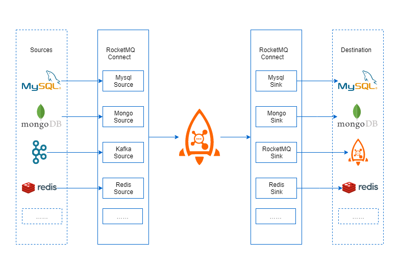
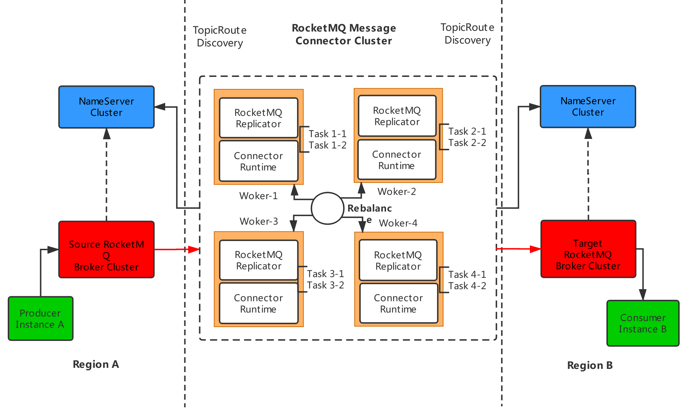

# RocketMQ Connect 简介

## RocketMQ Connect简介

### 基础介绍

**RocketMQ遵循Message Connector的设计理念，依托RocketMQ进行实现。**

简单理解RocketMQ Connect就是**借RocketMQ从其他系统获取数据发送到RocketMQ**，然后从**RocketMQ消费消息写入到其他系统**。主要由**Source Connector，Sink ConnectorRuntime**组成。

 **Source Connector**负责从其它系统获取数据，通过Producer发送到到RocketMQ。

 **Sink Connector**负责从Producer中消费消息，将数据写入到另外的系统。

 **Runtime**是Source ，Sink connector的运行时环境，负责加载Connector，提供RESTful接口，启动Connector任务，**集群节点之间服务发现，配置同步，消费进度保存，故障转移，负载均衡等能力。**


### **OpenMessaging 与RocketMQ关系**

OpenMessaging 是一套消息中间件领域的规范。OpenMessaging Connect是Connect方面的api，OpenMessaging 还有其他各种消息中间件邻域的规范，例如mq客户端规范，存储规范，实现OpenMessaging 规范可以做到厂商无关。

RocketMQ Connect这套规范的具体实现，实现这套规范的好处就是，只要是同样实现了OpenMessaging Connect的Source Connector或者Sink Connector都可以被RocketMQ Connect Runtime加载运行。  


### 应用场景



### **架构设计** 

如上图所示，在两个RocketMQ集群区域之间传输数据，在Region A部分是一套RocketMQ集群环境，Region B同样也有一个RocketMQ集群环境。在两个集群中间是RocketMQ Connect的主要运行环境。

#### Worker


运行Connector实例和Task的线程，一个Worker进程代表来一个Connector Runtime 运行时环境进程，多个Worker进程组成了一个集群，支持更多的Connect 和 Task的并行运行工作。其中，Connector Runtime 还具备了**配置管理、负载均衡和任务调度**；


参考Message Connector中Worker的定义，RocketMQ在Runtime启动参数中实现Worker的命名，具体参考 [Runtime 配置](rocketmq-runtime/#runtime-pei-zhi-can-shu-shuo-ming)

#### Runtime


**Runtime**为其上运行的各种类型Connector及其关联的Task任务**提供统一的运行时环境**（包括**负载均衡，实例间的调度，配置管理以及集群管理\)**


### **RocketMQ Connect的收益**

* 业务只需要专注于数据拷贝
* 系统支持可伸缩性
* 提供易用的RESTful api
* 支持流和批处理
* 简单的集群管理

