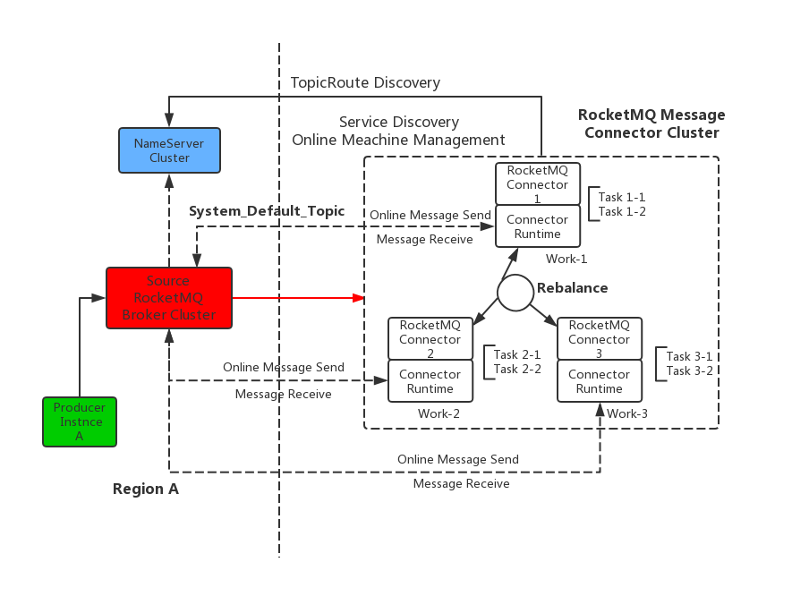
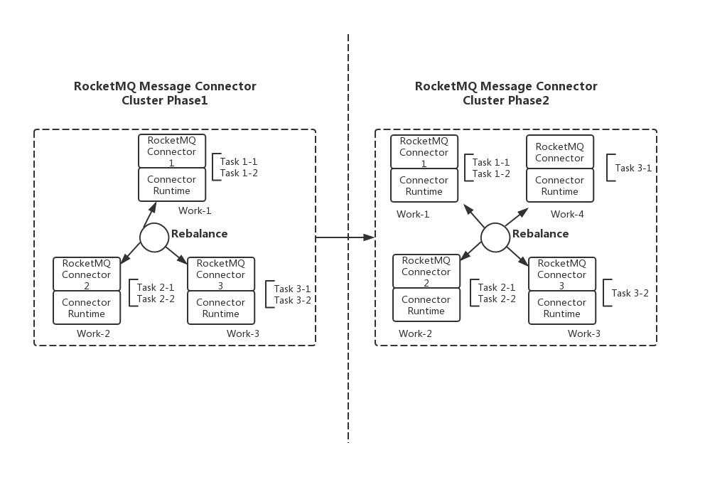

# RocketMQ Routing Task


#### **Task的定义**

执行具体的数据解析和转储的任务，会分配其去连接到具体的Source/Sink的数据分片。其中，

 **a.SourceTask**：从源数据系统中，执行完成数据解析工作，通过poll\(\)接口暴露给Connector Runtime。

 **b.SinkTask**：Connector Runtime从内存获取数据并通过put\(\)接口方法解析至目标数据源系统中。


### RocketMQ Routing Task的概念模型

在RocketMQ消息路由中，一个SourceTask表示一个拉消息或者转发消息的具体执行任务。这里有两点需要讨论：

1.   **Task表示从一个Topic上拉取消息，**即为Task精确到Topic？
2.  **Task表示从一个Partition/Queue上拉取消息：**即为Task精确到单个分区or队列？


**建议结论**

从目前现有的 "**OpenMessaging Connector Runtime"**来看，因为本身是遵循 “**OpenMessaging API**”,在"**DataEntry**"类的“**MessageFactory.createBytesMessage\(\)**”方法中的**queueName**实际上对应的是**RocketMQ的TopicName**，因此更加推荐上面的方案（1）



**注意：**在设计时候需要综合考虑上面两点，在实现上做到可配置化


### 
 RocketMQ Routing Source/Sink Task的服务发现与任务状态管理

在Work进程组成的集群中，各个Work进程需要**动态感知并管理**集群中当前存在的活动的Worker进程，因此首先想到的是用第三方组件（比如ZooKeeper、etcd或者数据库DB）来保存各个Worker进程的在线状态。但如果**采用第三方组件来保存这些状态信息，会加重RocketMQ消息路由的整体设计复杂度，同样会对实际部署和运维造成很多负担。**

所以，这里考虑通过各个Worker进程向源RocketMQ集群定时向**"系统默认的Topic"**，发送“**Online”的心跳信息**来维护自己的活动状态，其他的Worker进程**通过订阅该默认Topic来获取该Worker的心跳信息**。



 **注意**：Source和Sink Task可以用监听**不同的“系统默认的Topic”来区分。**


> **示例一**
>
> \*\*\*\*

### RocketMQ Routing Source/Sink Task共享运行时环境配置

对于各个Connector以及Task任务的配置信息，也可以采用上面“**服务注册与在线状态管理**”的方式来解决Worker集群内各个进程之间的配置信息动态感知和同步的问题。这里就不在重复介绍了。而对于配置信息的持久化可以**借鉴类似RocketMQ中各个“.Json”配置信息持久化**的方式来实现。

> **示例二**

### RocketMQ Routing Source/Sink Task的负载均衡与故障转移

* **Source/Sink Task任务的负载均衡与调度**

通过上面的**“RocketMQ Routing Source/Sink Task的服务发现与任务状态管理”**的机制可以使得集群中每个运行的Work都知道集群中当前运行的Task任务（即为集群中当前运行的视图）。所以，要做到Task的Rebalance负载均衡与调度还是比较容易的，这里可以在每个Worker端来完成Task的分配，并且把分配关系信息回传给源RocketMQ集群来存储就可以了。下图展示了RocketMQ Connector在本集群中新增加一个Worker进程后进行重新负载均衡和调度的过程。

> **示例三**

* **Source/Sink Task任务的故障转移**

在生产环境中Worker一般以集群方式部署的，如果其中一个Worker进程down掉后，考虑到集群整体的高可用性，需要有一种机制能够使得RocketMQ Routing Source/Sink Task故障转移，将原本运行于Woker宕机节点上的那些Task转移至其他正常的Worker节点上。这里，同样是基于上面的Task任务的负载均衡与调度策略。当出现有Worker节点掉线后，各个节点会进行重新的负载均衡调整，使得处于原本已经宕机的Woker节点上的Task可以自动转移至当前正常工作的Worker节点。

> 示例四

###  RocketMQ消息路由对ACL和配置同步的支持

* **对于带有鉴权的消息同步**

从Apache RocketMQ 4.4.0版本开始，**RocketMQ就支持了ACL**。因此，如果在RocketMQ集群开启ACL鉴权功能时，消息路由也需要支持ACL这个特性。

针对消息路由的消息同步和转发走的都是**VipChannel**的端口（**即为：10909端口**），同时在**RocketMQ Routing  Task**启动的时候加载Acl Admin账号的AK/SK值。

* **Source集群中的配置同步至Target集群**

在RocketMQ的消息路由中，需要考虑当其中一个集群的配置（包括ACL的鉴权信息）信息出现改变后，改变后的配置信息能够发送至远端的集群，并且远端集群能够感知并重新加载这部分的信息。尤其是，对于目前已经支持热加载的ACL鉴权配置信息。 另外，**Topic的配置信息也需要同步，包括Topic配置，offeset、TopicPerm、QueueNum。**

\*\*\*\*

####  

\*\*\*\*

\*\*\*\*

