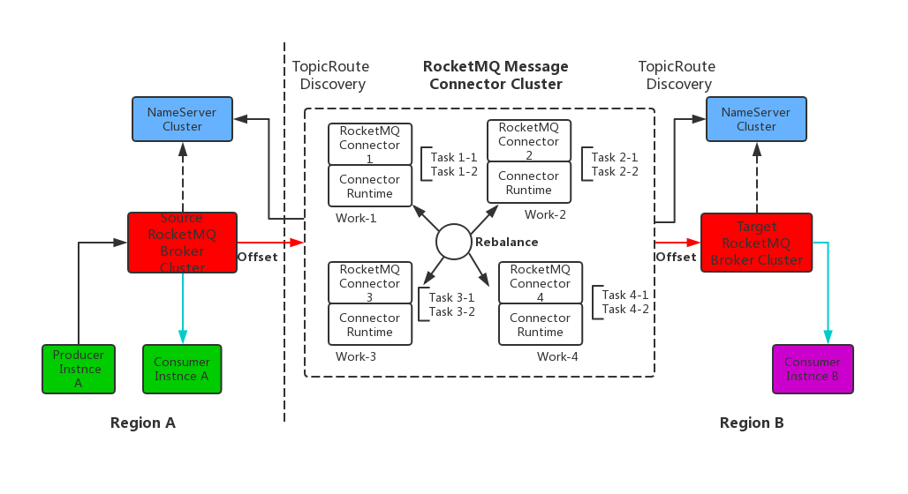

# 消费位点同步


#### 
 **消息路由中的消费位点同步**

一端的Consumer实例从Source集群中消费一条消息后，则在远端的Sink集群中，另外一个Consumer实例不应该重复消费到这条消息，做到**“Exactly Once”**的语义，因此需要一种机制来实现**Source集群于Sink集群的消费位点的同步**


如下图： 

> #### **方案一**
>
> 目前，想到的一种方案是将RocketMQ的Source集群中各个Topic的消费位点/进度这块数据Push至Work集群中的一个，由选择到这个Worker进程再转发至RocketMQ的Sink集群

