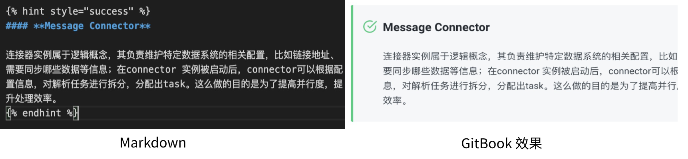

# 文档贡献说明

## 文档贡献流程概览


1. **本地修改文档**：在本地修改完文档后，提交对应的PR到RocketMQ-Connect
2. **合并PR**：社区负责人检查无误后，合并到Master分支
3. **自动同步**：通过定时脚本或者GitHub Action触发同步任务
   
## Markdown语法

本项目采用GitBook做完最终的展示效果，因此项目中Markdown的语法包含两部分：**MarkDown语法**和**GitBook特殊语法**

基本的Markdown语法都是可以支持的。



**特别提醒**
请将图片放在 `.gitbook/assets`文件夹下



## GitBook特别语法与事例

### SUMMARY文件

SUMMARY文件是文档的总目录，如果我们进行了目录的增删改查，请修改对应的目录项


### 提示效果

```

 中间文字
{\% endhint %}
```



### 副标题


