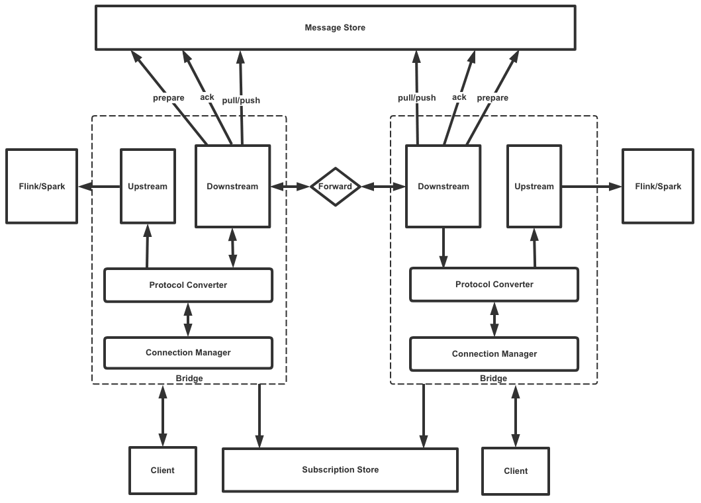

# 架构设计

如上图所示，各个子模块职责如下：
- Connection Manager: 管理客户端和Bridge之间的连接
- Protocol Converter：负责协议转换，将协议数据包转换成Bridge内部的Message
- Downstream module：下行模块，负责
    - 接收客户端（Producer）发送的消息
    - 处理客户端（Consumer）的订阅请求
    - 向客户端（Consumer）推送订阅的消息
    - 向其他Bridge转发消息
- Upstream module：上行模块，负责将客户端发送的消息上报给外部系统，例如Flink，Spark
- Message Store：消息存储模块，负责
    - 持久化所有需要保存的消息
    - 查询某个客户端所有的离线消息
    - 根据消息Id查询某一条消息
- Subscription Store: 订阅消息存储模块，负责
    - 根据topic查询订阅该topic的所有客户端
    - 维护topic -- client list的映射关系

