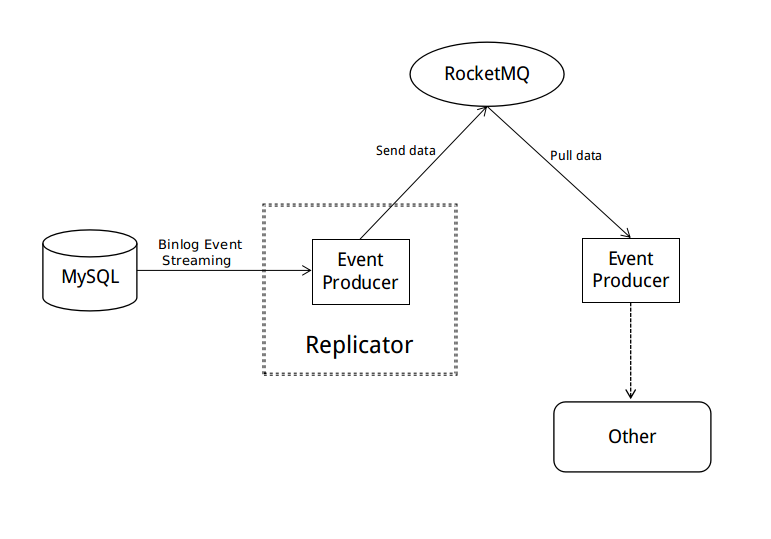
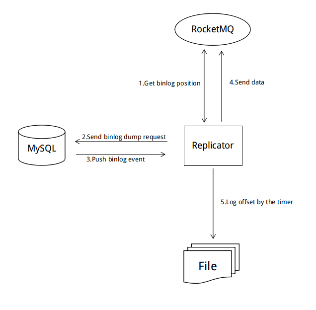

# RocketMQ-MySQL

## Overview

The RocketMQ-MySQL is a data replicator between MySQL and other systems. The replicator simulates a MySQL slave instance, parses the binlog event 
and sends it to RocketMQ in json format. Besides MySQL, other systems can also consume data from RocketMQ. With the RocketMQ-MySQL Replicator, more systems can easily process data from MySQL binlog at a very low cost.

## Dataflow

* 1. Firstly, get the last data from the queue, and get the binlog position from this
 data. If the data queue is empty, use the latest binlog position of MySQL. Besides that, customized setting of position of the wanted binlog is also supported.
* 2. Send a binlog dump request to MySQL.
* 3. MySQL pushes binlog event to the replicator. The replicator parses the data and accumulates it as a transaction-object.
* 4. Add the next-position of the transaction to the transaction-object and send it in json format to the queue.
* 5. Record the binlog position and the offset in the queue of the latest transaction every second.

## Quick Start

* 1. Create an account with MySQL replication permission, which is used to simulate the MySQL slave to get the binlog event, and the replication must be in row mode.
* 2. Create a topic in the RocketMQ to store binlog events to ensure that the downstream system consumes the data in order. Make sure the topic must have only one queue.
* 3. Configure the relevant information of MySQL and RocketMQ in the RocketMQ-MySQL.conf file.
* 4. Execute "mvn install", then start the replicator (via execute "nohup ./start.sh &").
* 5. Subscribe and process the messages.

## Configuration Instruction
|key               |nullable|default    |description|
|------------------|--------|-----------|-----------|
|mysqlAddr         |false   |           |MySQL address|
|mysqlPort         |false   |           |MySQL port|
|mysqlUsername     |false   |           |username of MySQL account|
|mysqlPassword     |false   |           |password of MySQL account|
|mqNamesrvAddr     |false   |           |RocketMQ name server address (e.g.,127.0.0.1:9876)|
|mqTopic           |false   |           |RocketMQ topic name|
|startType         |true    |DEFAULT    |The way that the replicator starts processing data,there are four options available: - DEFAULT: try to start processing data in the "LAST_PROCESSED" way,if failed, then in the "NEW_EVENT" way - LAST_PROCESSED: starts processing data from the last processed event - NEW_EVENT: starts processing data from the tail of binlog - SPECIFIED: starts processing data from the position that user specified,if you choose this option,the binlogFilename and nextPosition must not be null|
|binlogFilename    |true    |           |If "startType" is "SPECIFIED",the replicator will begin to replicate from this binlog file|
|nextPosition      |true    |           |If "startType" is "SPECIFIED",the replicator will begin to replicate from this position|
|maxTransactionRows|true    |100        |max rows of the transaction pushed to RocketMQ|