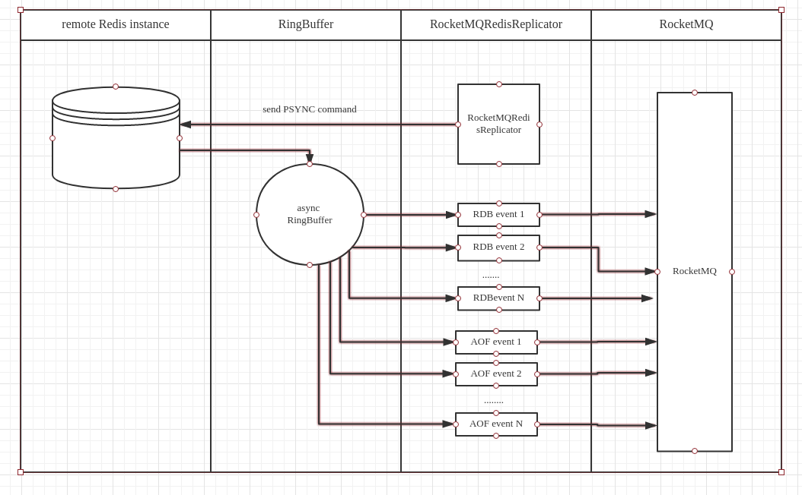

Table of Contents  
=================

   * [1. Rocketmq-redis-replicator](#1-rocketmq-redis-replicator)
      * [1.1. Brief introduction](#11-brief-introduction)
   * [2. Install](#2-install)
      * [2.1. Requirements](#21-requirements)
      * [2.2. Install from source code](#22-install-from-source-code)
   * [3. Simple usage](#3-simple-usage)
      * [3.1. Downstream via socket](#31-downstream-via-socket)
      * [3.2. Deploy as an independent service](#32-deploy-as-an-independent-service)
   * [4. Configuration](#4-configuration)
      * [4.1. Rocketmq configuration](#41-rocketmq-configuration)
      * [4.1. Redis configuration](#42-redis-configuration)
   * [5. Other topics](#5-other-topics)
      * [5.1. Built-in command parser](#51-built-in-command-parser)
      * [5.2. EOFException](#52-eofexception)
      * [5.3. Trace event log](#53-trace-event-log)
      * [5.4. Auth](#54-auth)
      * [5.5. Avoid full sync](#55-avoid-full-sync)  
      
# 1. Rocketmq-redis-replicator  

## 1.1. Brief introduction

Rocketmq redis replicator implement Redis Replication protocol written in java. It can parse, filter, broadcast the RDB and AOF events in a real time manner and downstream these event to RocketMQ.  

  

# 2. Install  
## 2.1. Requirements  
jdk 1.7+  
maven-3.2.3+  
redis 2.6 - 4.0.x  
rocketmq 4.1.0 or higher  

## 2.2. Install from source code  
  
```
    $mvn clean install package -Dmaven.test.skip=true
```  

# 3. Simple usage  
  
## 3.1. Downstream via socket  
  
```java  
        Configure configure = new Configure();
        Replicator replicator = new RocketMQRedisReplicator(configure);
        final RocketMQProducer producer = new RocketMQProducer(configure);

        replicator.addRdbListener(new RdbListener() {
            @Override public void preFullSync(Replicator replicator) {
                try {
                    if (!producer.send(new PreFullSyncEvent())) {
                        LOGGER.error("Fail to send PreFullSync event");
                    }
                } catch (Exception e) {
                    LOGGER.error("Fail to send PreFullSync event", e);
                }
            }

            @Override public void auxField(Replicator replicator, AuxField auxField) {
                try {
                    if (!producer.send(auxField)) {
                        LOGGER.error("Fail to send AuxField[{}]", auxField);
                    }
                } catch (Exception e) {
                    LOGGER.error(String.format("Fail to send AuxField[%s]", auxField), e);
                }
            }

            @Override public void handle(Replicator replicator, KeyValuePair<?> kv) {
                try {
                    if (!producer.send(kv)) {
                        LOGGER.error("Fail to send KeyValuePair[key={}]", kv.getKey());
                    }
                } catch (Exception e) {
                    LOGGER.error(String.format("Fail to send KeyValuePair[key=%s]", kv.getKey()), e);
                }
            }

            @Override public void postFullSync(Replicator replicator, long checksum) {
                try {
                    if (!producer.send(new PostFullSyncEvent(checksum))) {
                        LOGGER.error("Fail to send send PostFullSync event");
                    }
                } catch (Exception e) {
                    LOGGER.error("Fail to send PostFullSync event", e);
                }
            }
        });

        replicator.addCommandListener(new CommandListener() {
            @Override public void handle(Replicator replicator, Command command) {
                try {
                    if (!producer.send(command)) {
                        LOGGER.error("Fail to send command[{}]", command);
                    }
                } catch (Exception e) {
                    LOGGER.error(String.format("Fail to send command[%s]", command), e);
                }
            }
        });

        replicator.open();
```
## 3.2. Deploy as an independent service
1. `mvn clean package -Dmaven.test.skip`
2. `sh target/rocketmq-redis-pack/bin/start.sh`

# 4. Configuration

The config file located at target/rocketmq-redis-pack/conf/replicator.conf

## 4.1. Rocketmq configuration  

| parameter | default value| detail |
|-----------|--------------|--------|
| rocketmq.nameserver.address | 127.0.0.1:9876 | rocketmq server address|  
| rocketmq.producer.groupname | REDIS_REPLICATOR_PRODUCER_GROUP | rocketmq group name |  
| rocketmq.data.topic | redisdata | rocketmq topic name |  
| deploy.model | single | single or cluster |  
| zookeeper.address | 127.0.0.1:2181 | run on cluster model |  
| redis.uri | redis://127.0.0.1:6379 | the uri of redis master which replicate from |  

# 5. Other topics  
  
## 5.1. Built-in command parser  

|**commands**|**commands**  |  **commands**  |**commands**|**commands**  | **commands**       |
| ---------- | ------------ | ---------------| ---------- | ------------ | ------------------ |    
|  **PING**  |  **APPEND**  |  **SET**       |  **SETEX** |  **MSET**    |  **DEL**           |  
|  **SADD**  |  **HMSET**   |  **HSET**      |  **LSET**  |  **EXPIRE**  |  **EXPIREAT**      |  
| **GETSET** | **HSETNX**   |  **MSETNX**    | **PSETEX** | **SETNX**    |  **SETRANGE**      |  
| **HDEL**   | **UNLINK**   |  **SREM**      | **LPOP**   |  **LPUSH**   | **LPUSHX**         |  
| **LRem**   | **RPOP**     |  **RPUSH**     | **RPUSHX** |  **ZREM**    |  **ZINTERSTORE**   |  
| **INCR**   |  **DECR**    |  **INCRBY**    |**PERSIST** |  **SELECT**  | **FLUSHALL**       |  
|**FLUSHDB** |  **HINCRBY** | **ZINCRBY**    | **MOVE**   |  **SMOVE**   |**BRPOPLPUSH**      |  
|**PFCOUNT** |  **PFMERGE** | **SDIFFSTORE** |**RENAMENX**| **PEXPIREAT**|**SINTERSTORE**     |  
|**ZADD**    | **BITFIELD** |**SUNIONSTORE** |**RESTORE** | **LINSERT**  |**ZREMRANGEBYLEX**  |  
|**GEOADD**  | **PEXPIRE**  |**ZUNIONSTORE** |**EVAL**    |  **SCRIPT**  |**ZREMRANGEBYRANK** |  
|**PUBLISH** |  **BITOP**   |**SETBIT**      | **SWAPDB** | **PFADD**    |**ZREMRANGEBYSCORE**|  
|**RENAME**  |  **MULTI**   |  **EXEC**      | **LTRIM**  |**RPOPLPUSH** |     **SORT**       |  
  
## 5.2. EOFException
  
* Adjust redis server setting like the following. more details please refer to [redis.conf](https://raw.githubusercontent.com/antirez/redis/3.0/redis.conf)  
  
```java  
    client-output-buffer-limit slave 0 0 0
```  
**WARNNING: this setting may run out of memory of redis server in some cases.**  
  
## 5.3. Trace event log  
  
* Set log level to **debug**
* If you are using log4j2, add logger like the following:

```xml  
    <Logger name="com.moilioncircle" level="debug">
        <AppenderRef ref="YourAppender"/>
    </Logger>
```
  
```java  
    // redis uri
    "redis://127.0.0.1:6379?verbose=yes"
```

## 5.4. Auth  
  
```java  
    // redis uri
    "redis://127.0.0.1:6379?authPassword=foobared"
```  

## 5.5. Avoid full sync  
  
* Adjust redis server setting like the following  
  
```java  
    repl-backlog-size
    repl-backlog-ttl
    repl-ping-slave-periods
```
`repl-ping-slave-period` **MUST** less than `readTimeout`, default `readTimeout` is 30 seconds
