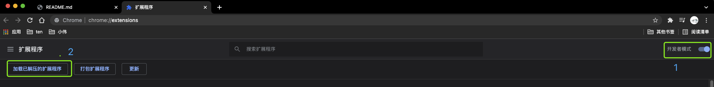

### 0. What's this chrome plugin for
> Auto build release notes as `Markdown` for issue list. 
> 

### 1. Install 
- 1.1 Git clone `this repo`

- 1.2 Copy folder `tools/chrome-plugin-rocketmq-helper` to your /path/to/chrome/plugin

- 1.3 Turn on Chrome's debug mode
> 

- 1.4 Install chrome plugin
> 
> 
> 

### 2. How to use
- 2.1 Go to <a href="https://github.com/apache/rocketmq/pulls?q=is%3Aopen+is%3Apr+milestone%3A4.9.3" target="_blank">RocketMQ PR Page</a>, choose some milestone.

- 2.2 `F12`, go to `Console tab` and refresh page
> 

- 2.3 Format PR's titles if `Issues can't be read cause of wrong title format, format it as: [ISSUE #issue_id] xxx, then refresh this page.` comes out

- 2.4 Copy those `Markdown`, and sort `<li>` into `Feature`、`Improvement`、`Bug` by yourself. Default is Improvement.
> 

- 2.5 Make a new release notes page for like <a href="https://github.com/apache/rocketmq-site/blob/master/_posts/2021-10-18-release-notes-4.9.2.md">2021-10-18-release-notes-4.9.2.md</a>

- 2.6 Copy `Markdown` from `step 2.4` into new release notes page, change `RocketMQ Version`、`Source` and `Binary` urls. 

- 2.7 For now, new release page done

